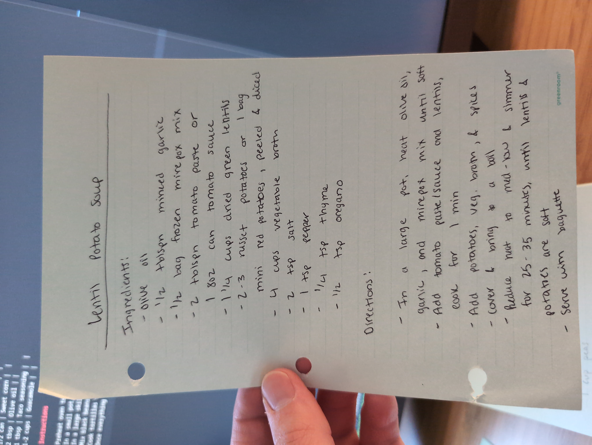

# Lentil Potato Soup

## Source

## Ingredients

| Serving | Ingredient | Notes |
|-|-|-|
| 2 tbsp | olive oil |  |
| 1/2 tbsp | minced garlic |  |
| 1/2 bag | frozen mirepoix mix | (carrots/onion/celery) |
| 2 tbsp | tomato paste | or 1 (8 oz) can tomato sauce |
| 1 1/4 cups | dried green lentils |  |
| 2-3 | russet potatoes | or 1 bag mini red potatoes, peeled & diced |
| 4 cups | vegetable broth |  |
| 2 tsp | Kosher salt | adjust to taste |
| 1 tsp | black pepper | freshly cracked preferred |
| 1/4 tsp | thyme | dried |
| 1/2 tsp | oregano | dried |

## Instructions

1. In a large pot, heat olive oil, then add minced garlic and frozen mirepoix; cook until softened.
2. Add tomato paste (or tomato sauce) and lentils, stirring and cooking about 1 minute.
3. Add diced potatoes, vegetable broth, salt, pepper, thyme, and oregano; cover and bring to a boil.
4. Reduce heat to medium-low and simmer, uncovered, for 25–35 minutes, until lentils and potatoes are tender.
5. Taste and adjust seasoning as needed; serve hot with a baguette.
